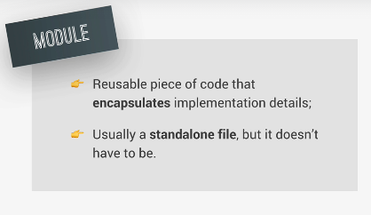
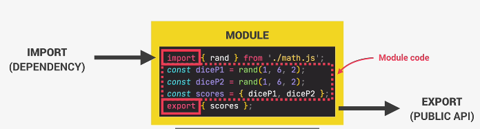
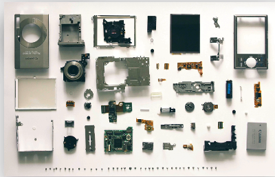
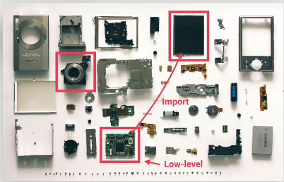
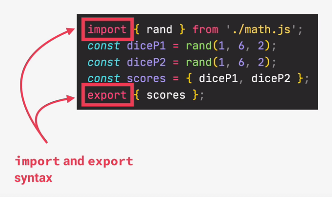

<h1>Modules Overview</h1>

A module is a reusable piece of code that encapsulates implementation details of a certain part of our project (sounds like a function or even a class) but the difference is usually a standalong file. This is not always the case but normally when we think of a module we think of a separate file.



A module always contains some code but it can also have ```imports``` and ```exports```.
- ```exports```, as the name says, we can export values out of a module. For example, simple values or even entire functions. Whatever we export from a module is called the ```PUBLIC API```. This is just like classes where we can also expose a public API for other codes to consume. In the case of modules, this public API is actually consumed by ```importing``` values into a module. 

- Just like we can ```export``` values, we can also ```import``` values from other modules. These other modules from which we import are called ```dependencies``` of the importing modules because the code that is in the module, that is importing cannot work without the code that it is importing from the external module. 



This entire logic is true for all modules in all programming languages. 

We can write code without modules. However, when a code base grows bigger and bigger, there start to be many advantages of using modules:

1) Modules make it really easy to compose software. We can think of modules as small building blocks then we can then put together in order to build really complex applications.

Let's take a camera as an example. A camera is composed of many different parts (modules). Each of this camera modules can be developed in complete isolation. You can have one engineer working on the lens and another one on the screen and even another one on the controller module. 



The best part of this is that each engineer can work on their own module without even understanding what the other engineers are doing. And also without understanding how the entire final camera works itself. 

2) Isolating components (modules) is another huge advantage of using modules. Again, isolating components actually means that each module can be developed in isolation wihtout the developer having to think about the entire code base. He doesn't even need to understand all of it, which makes it easy to collaborate on a larger team.

3) Modules make it very easy to abstract our code. Abstraction is like simplifying a complex task by breaking it into smaller, more manageable parts. It's a way of hiding the complex details and showing only the necessary features of an object or function. This helps us work with code more easily. We can use modules to implement low level code then other modules which don't really care about these low level details can import these abstractions and use them.

Going back to the camera example, the screen module, for example, does not care about the low level implementation details of the controller module. It can simply import the controller but without knowing how it works and use it to control other parts of the camera. That's essentially the power of abstraction.



4) Modules also naturally lead to a more organized code base because when we break up our code into separate isolated and abstracted modules, this will automatically organize our code and make it easier to understand.

5) Modules allow us to easily reuse the same code in a project and even across multiple projects. For example, if we use the module to implement a couple of mathematical functions in a certain project, and if we then need the same functions in the next project, all we need to do is to copy that module to the new project.

In our camera example, a certain company could now use the exact same lens or the exact same screen in different camera models all because they nicely abstracted these components into self-contained reusable modules.

Finally, this is how modules works in software design in general.

***

<h2>Modules in JavaScript</h2>

As of ES6, JavaScript has a native built-in module system. ES6 modules are modules that are actually stored in files and each file is one module. So, there is exactly one module per file. You might be thinking that scripts are also files right? That's true. Let's comapre these two types of files in order to understand that there are actually huge differences between old school scripts and modern ES6 modules.

1) In modules, all top level variables are scoped to the module. Basically, variables are private to the module by default, and the only way an outside module can access a value that is inside of a module is by ```exporting``` that value but if we don't export, then no one from the outside can see the variable.

In scripts, all top level variables are always global. This can lead to problems like global namespace pollution where multiple scripts try to declare variables with the same name and then these variables collide. So, private variables are the solution to this problem and that's why ES6 modules implemented it like this.

2) ES6 modules are always executed in ```strict mode``` while scripts on the other hand are executed in sloppy mode by default. So, with modules, there is no need to manually declare ```strict mode```. 

3) In modules, the ```this``` keyword is always ```undefined``` at the top level while in scripts, it points at the window object. 

4) What's special about modules is that we can export and import values between them using the ES6 ```import``` and ```export``` syntax. In regular scripts, importing and exporting values just impossible. 


 
There is something really important to note about imports and exports, which is the fact that they can only happen at the top level. As you know, outside of any function or any block. All ```imports``` are ```hoisted```, so no matter where in a code you're importing values, it's like the import statement will be moved to the top of the file. In practice, importing values is always the first thing that happens in a module.
