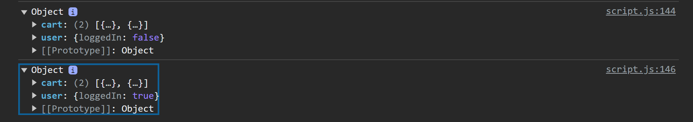

<h1>Introduction to NPM</h1>

**NPM** : NPM stands for Node Package Manager, it's both a software on our computer and a package repository.

Why do we need NPM? why do we actually need a way of managing packages or dependencies in our project? 

- Back in the day before we had NPM, we used to include external libraries right into our HTML, basically using the ```<script>``` tag, and this would then expose a global variable that we could use. This actually creates a couple of problems, at least in a big project, maybe not in small projects but in a huge project and a huge team, this is just not managable.
  
  - First, it does not make sense having the HTML loading all our JavaScript, that is just really messy.
    
  - Second, many times we would actually download a library file to our computer directly, for example, a JQuery JavaScript file. But then whenever a new version would come out, we would have to manually go to the site, download the new version, change the file in our file system manually, and then include it again, maybe with some other name with some other version number. 

  - Third, before NPM, there simply wasn't a single repository that contained all the packages that we might need. This made it even worse and more difficult to manually download libraries and manage them on our computers.

***

The reasons being stated above, we really need a way to manage our dependencies in a better and more modern way. NPM is exactly what we need to do that.

1) Go to your terminal and check if NPM is already installed, to do that, use ```npm -v``` :


If you get any number after doing that command, any number, then you're good. But if you got an error, that's because you didn't install Node.js. Check this [link](https://nodejs.org/en) to install it.  

2) In each project which we want to use NPM, we need to start by initializing it. For that, we can use ```npm init```, this will then ask us a couple of questions in order to create a ```package.json``` file. 


After doing initializing it, you will get a file called ```package.json```


This file here basically what stores the entire configuration of our project. As you can see, it's stuff like the project name, the version that we can keep on updating, the author and all kinds of stuff


3) To install a library using NPM, first, you must go to the library's documentation page to see what commands you will use. Let's take a look at the leaflet library:


- You write ```npm``` to write the program then ```install``` and then the name of the package ```leaflet```, this is the long version of installing it, you can also do: ```npm i leafet```. They are the same thing.


- After installing it, two things will happen:

  - First, in our package.json file, a new field is created for the dependencies, and the dependency that we have now is leaflet.

  

  - Second, we now have this folder called ```node_modules```, this folder itself contains the leaflet folder, this leaflet folder contains everything about the leaflet library that we need to include in our page. This folder simply contains everything about this package. Of course, the more packages we install, they will all get stored in the node_modules folder. 

  

3) We installed our library, now, if we want to use it, that wouldn't be easy without a module bundler because this leaflet llibrary actually uses the CommonJS module system. Therefore, we cannot directly import it into our code. We could only to that if we used a module bundler. 

We are not gonna use leaflet for now, this is just to show you how to install packages.

***

Now , we will install and import one of the most popular JavaScript libraries which is [Lodash](https://lodash.com/), Lodash is essentially a collection of a ton of useful functions. So it basially contain things that could or should be included in JavaScript, but are not. So, people simply implemented them in Lodash and so now we can use them. This libary has a Lodash version which uses CommonJS module system which we are not going to use. We are going to use a special version which is called ```lodash-es``` ES because of ES6 modules. 


The same thing will happen after installing it: the package will be added to the dependencies and the node_modules will now contain the lodash-es folder which contains everything about lodash-es.


Now, I want to include the module to deep clone objects, in the lodash-es folder, there's a module called cloneDeep.js, I will then import this module to my script.js by doing this:


After importing it, I can now use it.


Here's the output of the code above and as wee can see, it is working. We know that it is hard to deep clone objects with nested properties. On line 142, I set ```state.user.loggedIn = false;```, doing this will mutate the original ```state``` object so when we console.log it, the ```user.loggedIn``` property will now be ```false```. But by using the cloneDeep function, we can literally deep clone the state object. At line 139, I used Object.assign to make a new object and assign state object as a source of properties and stored it to the variable stateClone. After that, I used the cloneDeep function which comes from lodash to deep clone the stateClone object and after deep cloning it, I stored it to stateDeepClone. We can see that the ```user.loggedIn``` property of the deep cloned object is true even if we set it as false on line 142. This just means that the deep cloning was successful. 



#

We just used a piece of open source softtware to solve a problem that we have. 

***

Let's say that you want to move your project to another computer, or also share it with another developer or even check it into version control like Git. In all of this situations, you should never ever include the node_modules folder. When you copy your projects somewhere else there is no reason to include the huge node_modules folder, because in a real project, it will actually be really, really huge. It does not makes sense to include it because they are already at NPM so you can always get them back from there.

You might ask: If I copy my project without the node_modules folder, without the dependencies, will I have to install all of them one by one again? What if I have a hundred of dependencies. Well, that's again where the important ```package.json``` file comes into play. 

To show you this I will delete my node_modules folder:

  

After deleting it, It will throw an error:


But there is fortunately a very easy way to get it back. All we have to do is ```npm``` then ```install``` or ```i``` without any package name. Then, NPM will reach into your ```package.json``` file, look at all the dependencies, and install them back.


As you can see that our node_modules folder is back:


***

With everyting being stated above, you now have a basic and good understanding of how to work with NPM, downloading packages, and also include them in your code. However, importing packages like we did when we imported cloneDeep from lodash-es, specifying the entire path is not practical at all. Check out the file in this repository about Parcel to fix this. 


 


