<h1>Bundling with Parcel and NPM scripts</h1>

**Parcel** : is just another tool which is also on NPM. We will use NPM to install it using: ```npm i parcel --save-dev```, this is now be in a different dependency (dev dependency):

 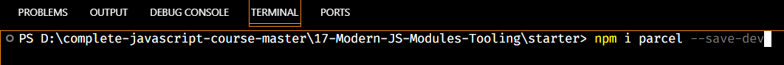

```devDependency``` is like a tool that we need to build our application, but it's not a dependency that we actually include in our code. It's simply a tool, that's why it's called devDependency because we can use it to develop our project. So it will appear as a new field in ```package.json```.

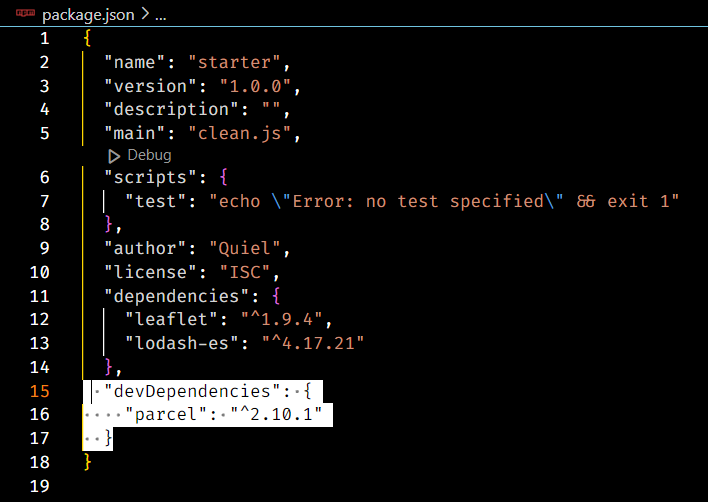

<h2>Using Parcel</h2>

We cannot use parcel like this: ```parcel index.html```. This does not work with locally installed packages. Our parcel was installed locally (as we did: ```npm i parcel --save-dev```) only on this project, that's why it showed up in ```package.json``` of the project.

To use parcel in the terminal, we have 2 options:

1) Using: ```npx parcel index.html``` the option that we pass into parcel is the entry point. The entry point is ```index.html``` because that's where we include our ```script.js```, so basically the file we want to bundle up. 

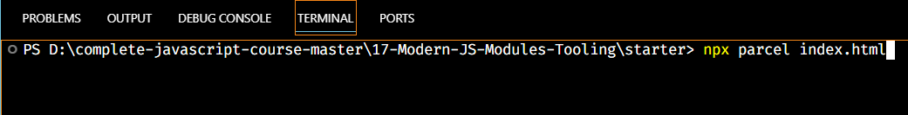

 - After doing that, parcel then also starts a new development server URL:

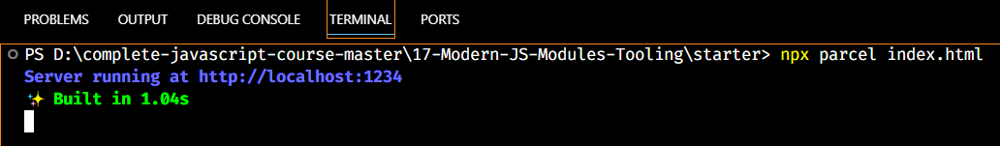

- So basically, besides only bundling, it also does exactly the same job as our live-server.

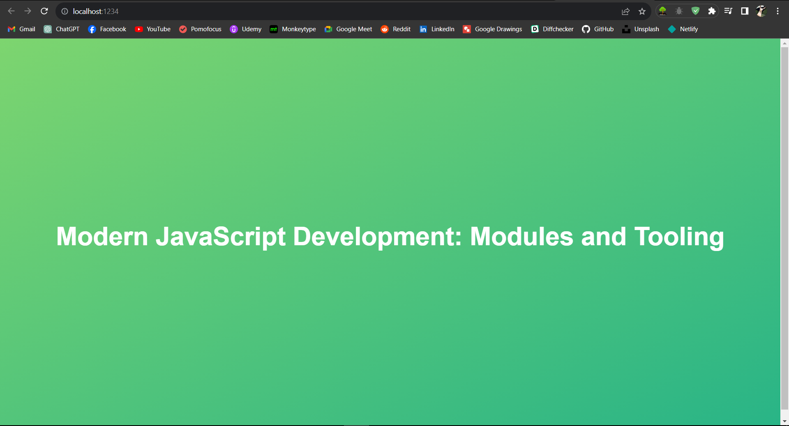

- Parcel also created a ```dist``` folder which stands for distribution because it is essentially gonna be this folder that we will send for production. So basically it's the code in this folder that we will send to our final users.

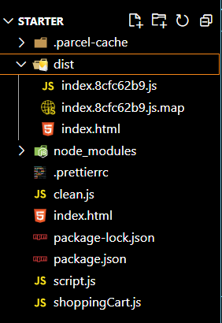

As you can see above, it created a new index.html and also a bunch of JavaScript files.

If we take a look at the ```index.html``` file inside the ```dist``` folder, we can see that it is a new one (new index.html) because the included ```<script>``` inside it is now no longer the one that we built ourselves but it is a new one. This new script is basically the bundle itself. If you check it out, you will see that this new script does include some of the stuff that we have in our other modules, and it will essentially contain all of our code in this new file.

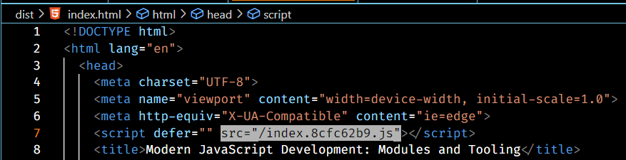

Now, whenever we save the original script file, then it will reload the file / server URL that was given to us by Parcel just as we had before with live server.

However, in Parcel, we can activate something even better which is called ```hot module replacement``` so we can write:

```js
if(module.hot) {
 module.hot.accept();
```

The code above is code that only Parcel understands and so of course it will not make it into our final bundle because the browser is not going to understand any of it. But anyway, what ```hot module reloading``` means is that whenever we change one of the modules, it will then of course trigger a rebuild but that new modified bundle will then automatically like magic, get injected into the browser without triggering a whole page reload. Again, if we change something in one of our modules, this will then not reload the page and only updates the part of the page that has changed. This will be helpful for maintaning state on our page whenever we are testing out something.

#

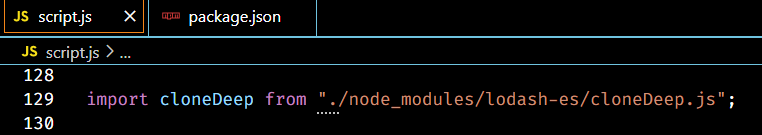

When we first included cloneDeep from lodash, this is quite cumbersome doint it like this. And so that't why in all module bundlers, there's no need for specifying the entire path to any module. So instead, we can simply do this:

- All we need to say is that we want to include the lodash library. Parcel will the automatically finds the path to this module and will simply import it like the code below, without us having to manually type the entire path to there. 

- In fact, this works with all kinds of assets. So even with HTML or CSS or SASS files, or even images, and of course also all kinds of modules, so not only ES6 modules, but this is also going to work with CommonJS modules. Parcel can work with all CommonJS modules as well. This way, we can then simply use all the modules that are available on NPM and which still use this older module format (CommonsJS).

```js
import cloneDeep from "lodash-es";

// OR

import cloneDeep from "lodash";
``` 

2) Using: ```npm script```, this is the way we actually use it in practice. So ```npm scripts``` are basically another way of running locally installed packages in the command line/terminal. They also allow us to basically automate repetitive tasks. Therefore, we then don't have to write ```npx parcel``` and all of that everytime we want to use it.

In the ```package.json``` file, we can simply create a script here:

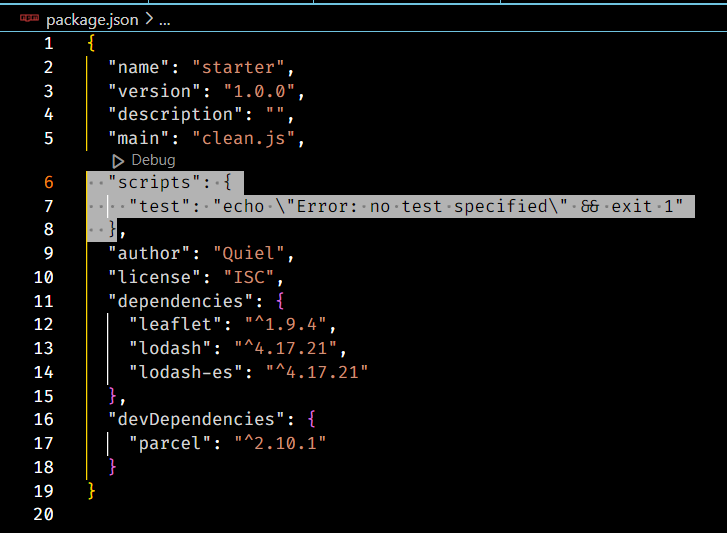

So we need ```""``` and then the name of the script, the default name is "start", and then the script itself inside ```""```, the script is going to be simply ```parcel index.html```: 

```js
"scripts": {
 "start": "parcel index.html"
}
```

Remember that we can't directly write ```parcel index.html``` in the command line/terminal, but we can write it in the npm script first then use it in the terminal.

To run the command, we do: ```npm run start```, we are basically running the npm script here which is ```start``` that we defined inside the scripts of package.json.

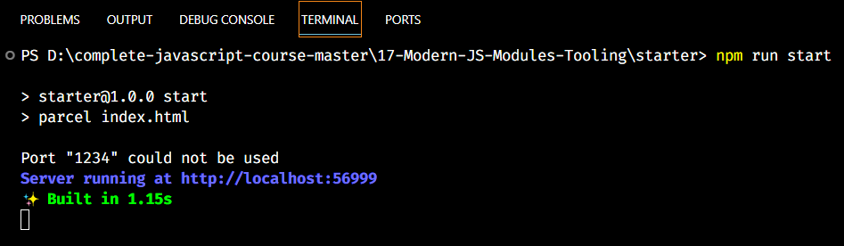

It's doing the same thing as before but now we have the simple command that we can execute whenever we want to start Parcel and whenever we want to start developing. 

***

Whenever we are done developing our project, it is time to build the final bundle. So the bundle that is compressed and has dead code elimination and all of that. For that, we another Parcel command. Let's add that as another script:

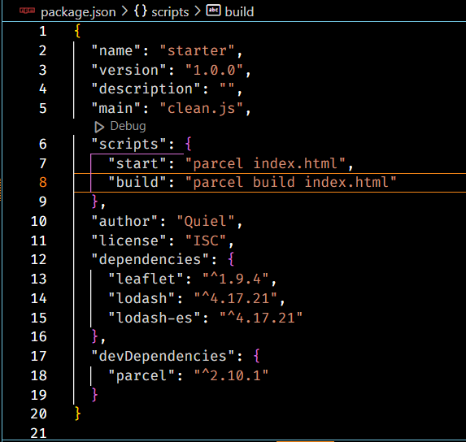

We can run this by doing ```npm run build```. 

NOTE: If you encounter an error when you run his command, just delete the ```"main": "script.js"``` from your package.json. This has something to do with parcel config. Our entry point is the ```index.html file```, but the main property from the package.json file tells parcel it should be ```clean.js``` file.


