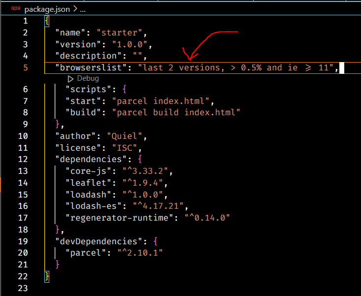

<h1>Transpiling and Polyfilling</h1>

<h2>Transpiling:</h2>

Transpiling is like ```translating code``` from one language to another. In the context of JavaScript, it's usually used to convert code written in a newer version of JavaScript (ES6/ES7/ES8) into an older version (usually ES5) that can run in older web browsers. This is done to ensure that your code works in as many browsers as possible, even if they don't support the latest JavaScript features. A popular tool for transpiling JavaScript is Babel.

For example, if you write modern ES6 JavaScript code like this:

```js
const myFunction = () => {
  console.log("Hello, World!");
};
```

Babel can transpile it into older ES5 code like this:

```js
var myFunction = function myFunction() {
  console.log("Hello, World!");
};
```

This way, your code can be used in a wider range of web browsers.

<h2>Polyfilling:</h2>

Polyfilling is like filling in the gaps. It's used to add missing functionality to web browsers that don't support certain features of JavaScript or web standards. A polyfill is a piece of code that provides the missing functionality in a way that allows your code to work consistently across different browsers.

For example, if a browser doesn't support the ```Array.prototype.includes``` method, you can use a polyfill to add it. Here's a simple polyfill for that method:

```js
if (!Array.prototype.includes) {
  Array.prototype.includes = function(searchElement) {
    for (let i = 0; i < this.length; i++) {
      if (this[i] === searchElement) {
        return true;
      }
    }
    return false;
  };
}
```

By using polyfills, you ensure that your code behaves the same way in older browsers as it does in modern ones.

#

In summary, transpiling helps make your modern JavaScript code compatible with older browsers, while polyfilling helps add missing features to those older browsers. Both are essential for creating web applications that work well across different platforms.

<H2>Transpiling in Parcel@2</H2>

A few things have changed since the release of Parcel@2, and one of them is how you can transpile your code to make it work in older browsers. The following explains what has changed, and provides a step-by-step guide to make transpilation work in Parcel@2.

**What has changed?**

- Parcel@1 was transpiling your code automatically using Babel. You could configure it by creating the .babelrc file in your project, and putting Babel's settings there. Parcel@2 ships with its own transpiler, and it doesn't transpile your code by default. To enable transpiling, you will need to include the browserlist property in the package.json file in your project. This new transpiler is meant to be faster than Babel. Parcel@2 also comes with default presets for JavaScript, TypeScript and React.

You can find more information about it in Parcel's docs: [https://parceljs.org/getting-started/migration/#babel](https://parceljs.org/getting-started/migration/#babel)

**Step-by-step guide**

To make transpiling and polyfilling work, follow these steps:

1) Install __core-js__ using the ```npm i core-js``` command in your Terminal to provide polyfills for your code.

2) Import __core-js__ in your project. Put this line ```import "core-js/actual";``` somewhere at the top in your JavaScript file.

3) Add this line to the __package.json__ file in your project

```js
"browserslist": "last 2 versions, > 0.5% and ie >= 11",
``` 



You can change it according to the needs of your project. For example, I included support for Internet Explorer 11 just to show you that newer syntax like `class` will be transpiled because this browser doesn't support it.

4) Build your project with ```npm run build```

**How to check if it works?**

Include some newer syntax in your code, in this case, I'll use the class syntax because I want to include IE11, which doesn't support it. Then, build your project with npm run build, and open your JavaScript file from the dist directory. Search for the word "class", and see if it exists in the transpiled code. Note that it may still exist in the transpiled code as a string, and not as the class statement. You can also do this with Arrow Functions, after transpiling it, it will be converted to a regular function.

<h2>Transpiling vs. Polifilling</h2>

When we talk about transpiling in JavaScript, we usually mean a process of translating ES6+ code to the older standard supported by old browsers. For example, the class syntax that works in modern browsers doesn't work in Internet Explorer. Transpiling would translate the class syntax into a regular function that works in IE. You can try this yourself in [Babel's playground](https://babeljs.io/repl#?browsers=defaults%2C%20ie%20%3E%3D%2011&build=&builtIns=false&corejs=3.21&spec=false&loose=false&code_lz=OQVwzgpgBGAuBOBLAxrYBuAUJ5AbAhmGFACoRxQDemUyA9gHZzwip3wAUAlFQL5SZeQA&debug=false&forceAllTransforms=false&modules=false&shippedProposals=false&circleciRepo=&evaluate=false&fileSize=false&timeTravel=false&sourceType=module&lineWrap=true&presets=env%2Creact%2Cstage-2&prettier=false&targets=&version=7.22.10&externalPlugins=&assumptions=%7B%7D). Although, the code produced by Babel isn't very readable for humans, you can probably see that the `class` syntax was replaced by a bunch of functions.

Transpiling is concerned only about the syntax, but what about new built-in functions that are constantly added to JavaScript? For example, the Array's at() method was added to Chrome 92 in 2021. How to make it work in older browsers? That's the role of polyfilling. A polyfill is a piece of code that implements this new functionality, for example, the at() method. You can include it in your code, and use the at() method even in older browsers that don't support it. The core-js library that we installed before is a collection of different polyfills.

Usually, we need both transpiling and polyfilling to provide support for older browsers.


